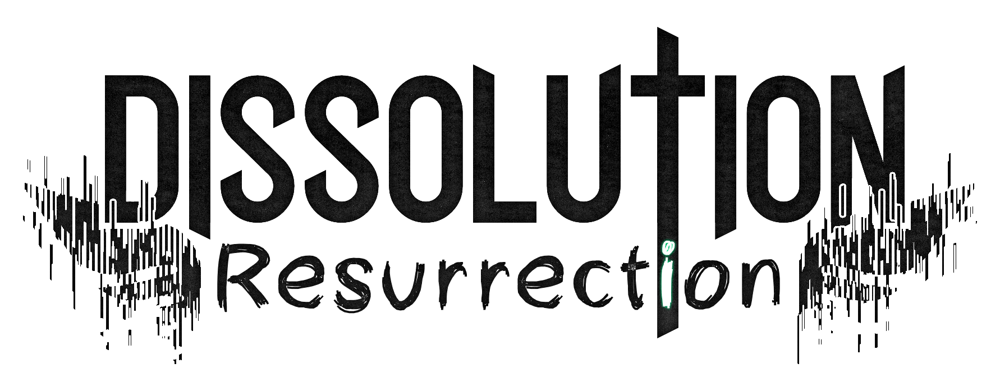

### This mod never dies:

- New and re-written undead gameplay, fluid, cross-mod compatible, and polished (just a few bugs here and there).
- All previous items, blocks and config options not mentionned in this map are to be removed. Also, states of souls are no longer a thing, to provide the player with more "real time choices" and less "anticipated limitations".
- However, many features still stay:
  - Strong / weak soul selection. When joining a world for the first time, the player will be granted the choice between the mod's death system or the vanilla death system.
  - Soul mode. If the player chose a strong soul, upon death, his soul leaves his body, allowing a free roaming of the world in order to select a new body to inhabit.
  - Undead possession. Since it has been re-written to be the most enjoyable possible, the undead possession system is here to stay. When in soul mode, you will be able to enter any undead monster's body and control them. This will give you access to their inventories, advantages but also inconveniences.

### Items:

- Human flesh (raw): 
  - When eaten by a human player, restores 4 food points.
  - When killing a human player or villager, drops 1-3.
  - When eaten by an undead player regenerates 4 health points.
  - When eaten by an undead player, has a chance of $hp * 4$ % to revert it back to human.
  - Can be crafted (unshaped) with rotten flesh and ghast tears (1:1:1).
  - Can be cooked like any meat.
  - When right-clicking any undead mob with it, has a chance of $hp * 4$ % to revert the mob back to human, resulting in an empty player with no soul, ready to be possessed.
- Human flesh (cooked):
  - Can only be eaten by a human player, restores 8 food points.

### Config options:

- `noHumanFlesh`: When true, human flesh is never dropped and can't be consumed. In order to regain a human body, the player will have to apply the same method used to convert back a zombie villager to himself, via weakness potions and golden apples.
- `forceStrongSoul`: When true, all players will be forced into having a strong soul, totally disabling the vanilla system.
- `skipDeathScreen`: When true, upon death, the death screen will be skipped, resulting in a more fluid experience. This only applies to strong soul players. This can cause some interferences with other mods that use the death screen related events.